# Веб-приложение для оптимизации портфеля проектов

Автор: **Чистяков К.С.**

## Описание проекта:
Данное веб-приложение предназначено управления и оптимизации портфелями проектов с учётом ограниченных ресурсов (Resource-Constrained Project Scheduling Problem). Сервис учитывает взаимосвязи задач и ресурсов, минимизируя сроки выполнения проектов.

## Функции веб-приложения:
- Добавление новых и редактирование сохраненных проектов
- Добавление новых и редактирование сохраненных портфелей проектов
- Визуализация оптимального расписания задач проекта, с учётом ограничения по ресурсам, в виде диаграмм Ганта
- Визуализация оптимального расписания задач проектов внутри портфеля, с учётом ограничения по ресурсам, в виде диаграмм Ганта
- Построение сводных диаграмм Ганта для сравнения нескольких проектов вне портфеля

## Используемые технологии и инструменты:
Языки программирования:
- **Python**
- **Html**
- **JavaScript**

Фреймворки:
- **Flask**
- **Bootstrap 5** 

Библиотеки python:
- **SQLAlchemy**
- **Pyomo**

Библиотека js:
- **Plotly.js**

СУБД:
- **PostgreSQL**

Решатель задач оптимизации:
- **GLPK**

## Запуск проекта:
### Установка зависимостей:
```bash
pip install flask sqlalchemy flask_sqlalchemy psycopg2-binary pyomo
```

### Настройка БД:
```sql
CREATE DATABASE rcpsp_db;
```

### Установка GLPK:
- Скачайте и установите GLPK (https://sourceforge.net/projects/winglpk/)
- Укажите путь к glpsol.exe в app.py:
```python
solver_path = r"C:\GLPK\w64\glpsol.exe"
```

### Запуск приложения:
```bash
python app.py
```
Откройте веб-приложение по адресу: http://localhost:5000

### Структура проекта:
```csharp
Diploma/
├── app.py                  
├── models.py               
├── templates/              
│   ├── base.html
│   ├── index.html
│   ├── projects.html
│   ├── all_in_one.html
│   ├── compare_projects.html
│   ├── edit_projects.html
│   ├── select_projects.html
|   ├── portfolios.html
|   ├── new_portfolio.html
|   ├── portfolio_results.html
│   └── includes/
│       ├── head.html
│       ├── navbar.html
│       └── footer.html
```

## Обзор работы программы
### Главная страница:
В начале работы с веб-приложением для оптимизации портфеля проектов пользователь попадает на главную страницу. Здесь находятся три кнопки: 
1) «Добавить проект» — отправляет пользователя на страницу создания проекта;
2) «Сохраненные проекты» — отправляет пользователя на страницу для работы с проектами, которые были созданы ранее;
3) «Портфели проектов» — отправляет пользователя на страницу для создания или работы с портфелями проектов.

Кроме того, нужно отметить верхнюю шапку сайта, с помощью которой также можно попасть на все эти страницы.

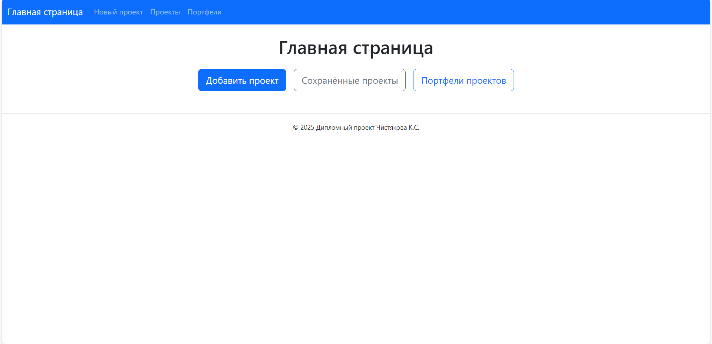

### Создание нового проекта:
Если пользователь нажимает на кнопку «Добавить проект», то он попадает на страницу для создания нового проекта. Здесь у него есть возможность добавить проект в ранее созданный портфель проектов (если такой имеется) или не добавлять. Далее ему необходимо ввести название, указать имеющиеся для проекта ресурсы и их количество, задания и их длительность, количество ресурсов необходимых для выполнения каждой из задач, а также определить зависимости между задачами. После чего пользователь может нажать на кнопку «Сохранить и оптимизировать», и ему откроется страница с результатами оптимизации по данному проекту.

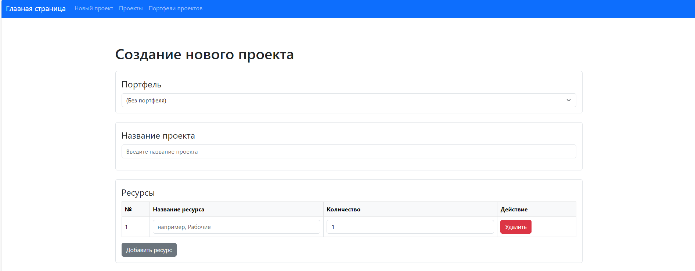
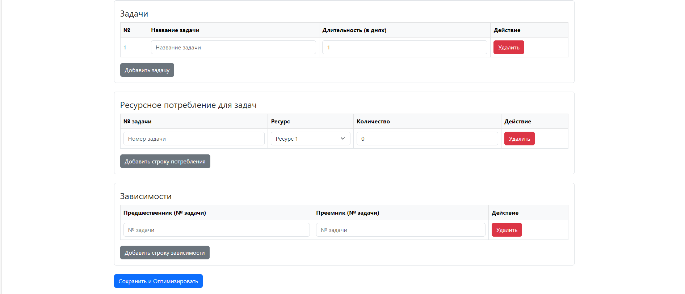

---
> **Примечание:** Если пользователь добавил проект в один из портфелей, то у него появляется возможность назначать на задачи общие ресурсы портфеля (если таковые имеются).
---
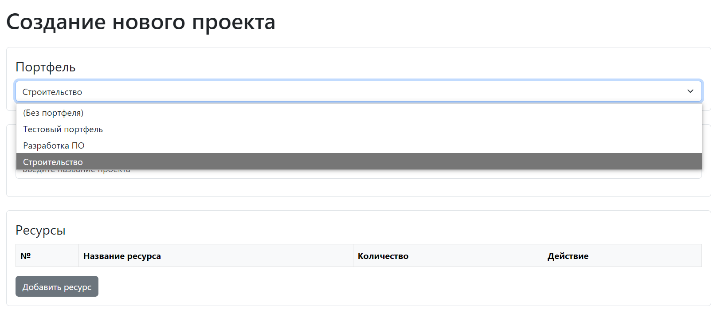

**Назначение общих ресурсов на задачу происходит аналогично добавлению локальных ресурсов проекта в разделе «Ресурсное потребление задач»:**
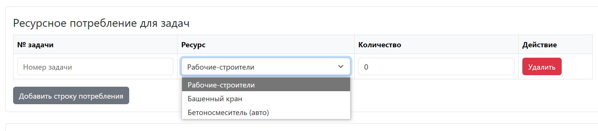

#### Пример оптимизации отдельного проекта вне портфеля:
После заполнения страницы создания нового проекта и нажатия на кнопку «Сохранить и оптимизировать», происходит расчёт оптимального по времени плана выполнения задач. Далее пользователь попадает на страницу с результатами по этому проекту. Они представлены в виде подробных таблицы и диаграммы Ганта, отражающих сроки выполнения задач. Кроме расписания задач, приложение также отображает диаграмму загрузки ресурсов во время выполнения проекта, что помогает пользователю выявлять узкие места и лучше оптимизировать планирование.

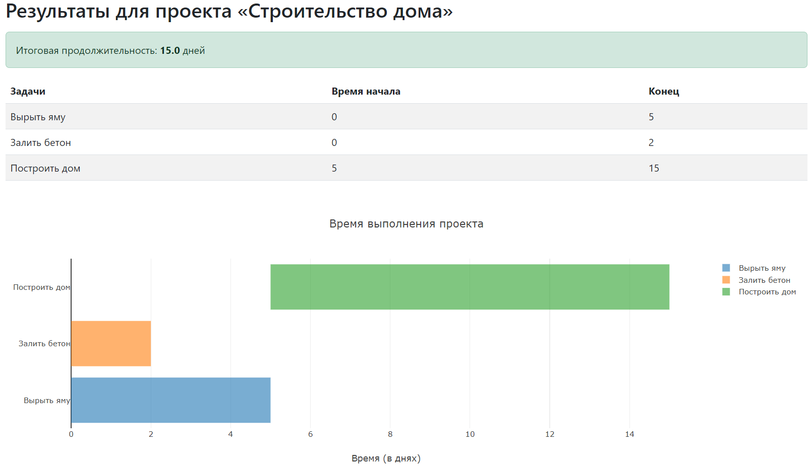
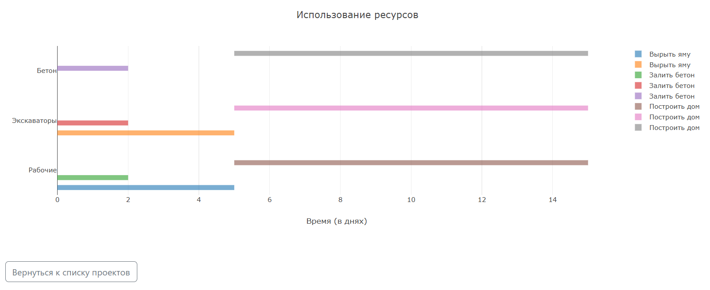

### Возможность просмотра и редактирования сохраненных проектов:
После создания проекты не удаляются, а сохраняются в базу данных и отображаются в общем списке на странице «Сохраненные проекты». Здесь пользователь нажав на названия ранее созданных проектов может просматривать результаты оптимизации по ним. Также имеются возможности редактирования и удаления проектов.

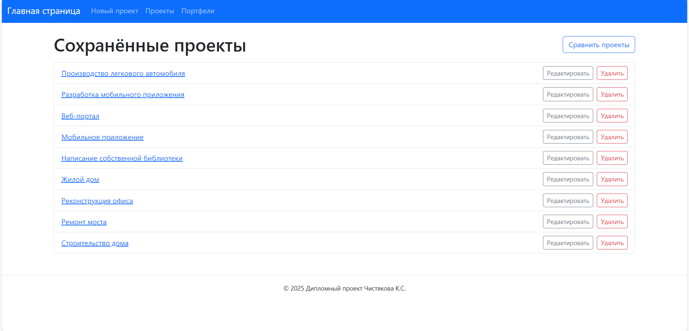

### Возможность сравнения нескольких проектов:
Кроме возможности просмотра результатов каждого отдельного проекта, веб-приложение также позволяет сравнивать оптимальные планы сразу нескольких проектов. Для этого пользователь нажимает кнопку «Сравнить проекты» на странице сохраненных проектов. После чего человек выбирает проекты из списка и нажимает на кнопку «Показать сравнение». Далее генерируются сводные таблица и диаграмма Ганта, которые показывают оптимальные планы каждого в отдельности проекта. Они представлены разными цветами, что облегчает визуальный анализ сроков их выполнения.

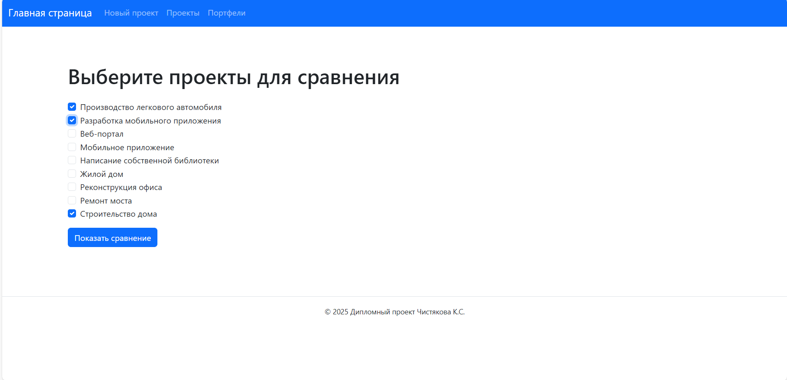

#### Сравнение трёх проектов вне портфелей для примера:
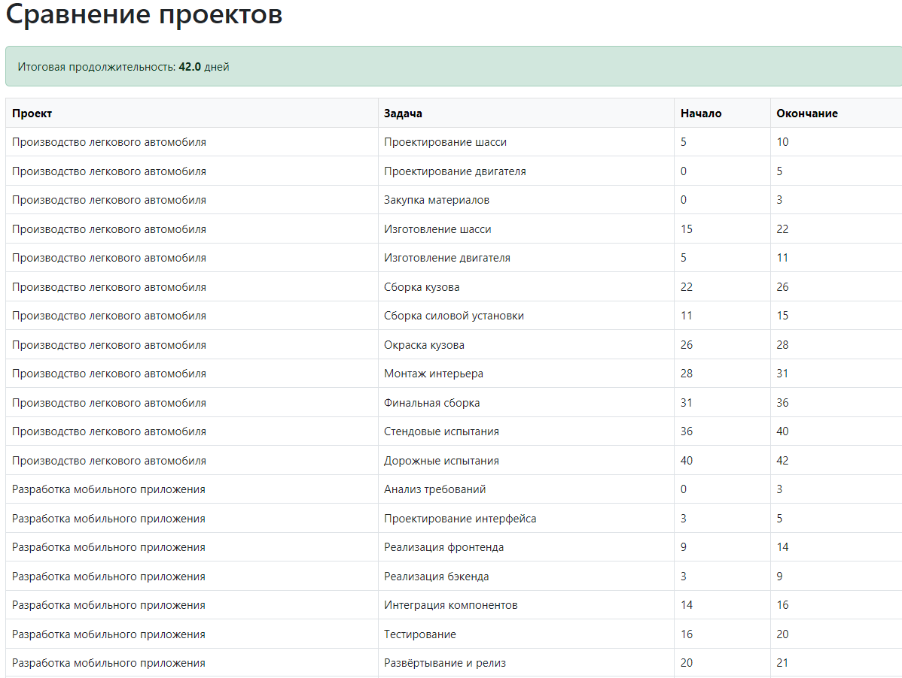
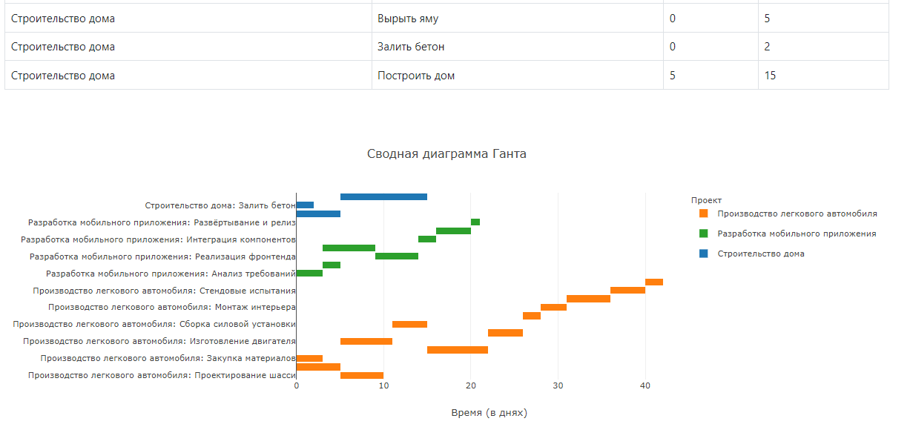

## Портфели проектов:
Одна из основных функций веб-приложения — возможность создания портфелей проектов, и их оптимизации. Для этого пользователю необходимо на главной странице или на шапке сайта нажать на кнопку «Портфели проектов», после чего его отправит на страницу, где можно создавать портфели проектов, работать с ними, а в случае надобности — удалять.

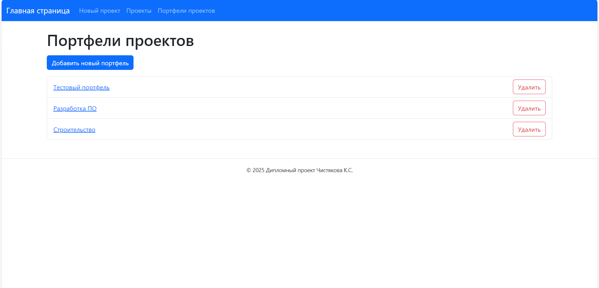

### Возможность создания нового портфеля:
Для создания нового портфеля достаточно нажать на кнопку «Добавить новый портфель», в новом окне ввести его название и нажать сохранить. После чего при нажатии на его название на странице со всеми портфелями проектов мы попадём на страницу работы с ним.


### Пример портфеля 1 — «Разработка ПО»:
Для примера работы с портфелями проектов будем использовать уже созданный портфель «Разработка ПО».

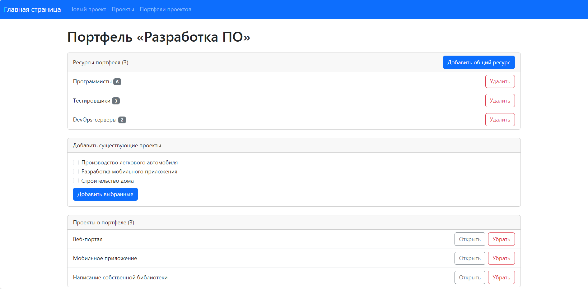

Как мы можем видеть, внутри портфеля можно задавать общие для его проектов ресурсы. Так сейчас на наш портфель выделено: 6 программистов, 3 тестировщика и 2 DevOps-сервера. Любой проект внутри портфеля может ими воспользоваться, если у него этого требуют задачи. Кроме того, у пользователя всегда имеется возможность добавить или удалить общие ресурсы.

---
> **Примечание:** В этом портфеле для примера все проекты используют только общие ресурсы портфеля, то есть не имеют собственных ресурсов, доступных только им.
---

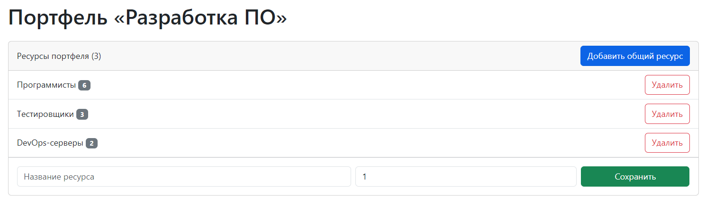

Также имеется возможность добавления уже созданных проектов внутрь портфеля. Однако для этого задачи проекта не должны требовать использования общих ресурсов другого портфеля. Несоответствующие этому условию проекты не будут доступны для выбора.

---
> **Примечание:** Как мы можем вспомнить из текста выше, в портфель также можно добавить проект при его создании.
---

**До добавления проекта «Написание собственной библиотеки» в портфель:**
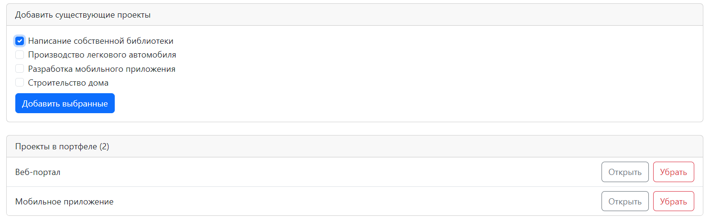
**После добавления проекта «Написание собственной библиотеки» в портфель:**
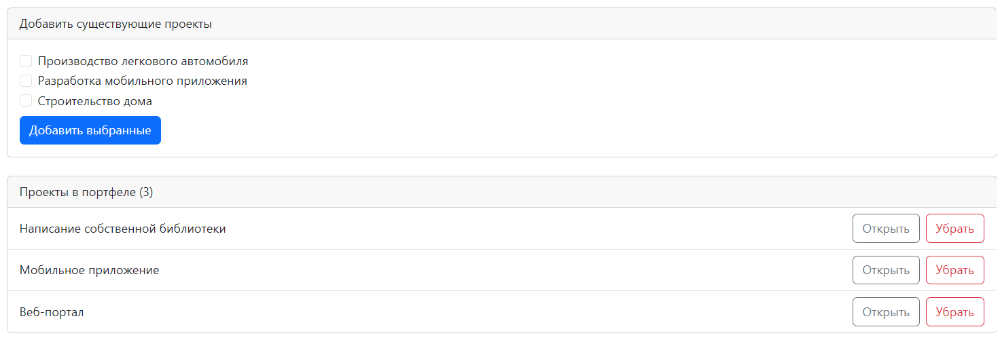

#### Результаты оптимизации портфеля «Разработка ПО»:

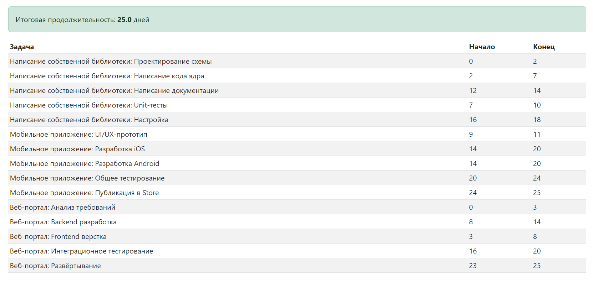
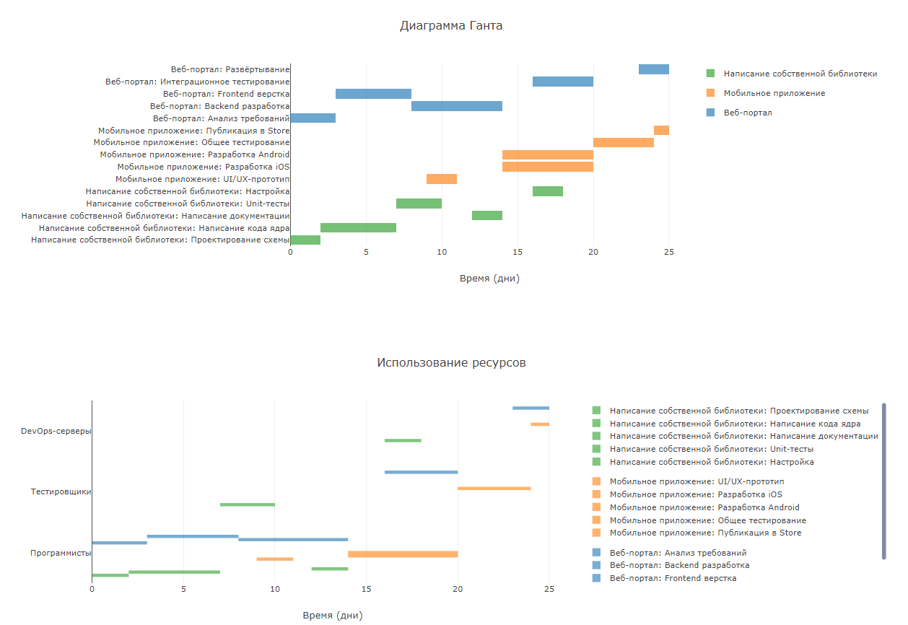

При оптимизации учитывалось, что в каждый отдельный промежуток времени проектами портфеля не может быть задействовано больше общих ресурсов, чем их изначально задано. То есть всегда выполняется условие: задействованный общий ресурс <= общему количеству этого общего ресурса (Например: задействованных программистов <= 6).

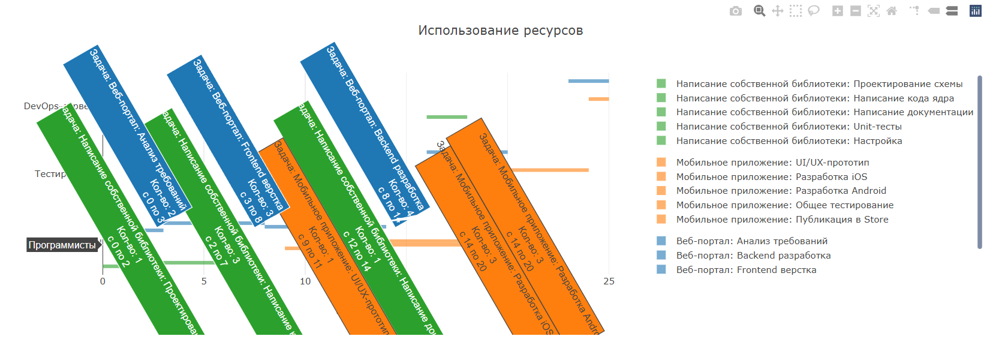


### Пример портфеля 2 — «Строительство»:
---
> **Примечание:** Здесь проекты используют уже как общие ресурсы портфеля, так и свои собственные, доступные только им.
---
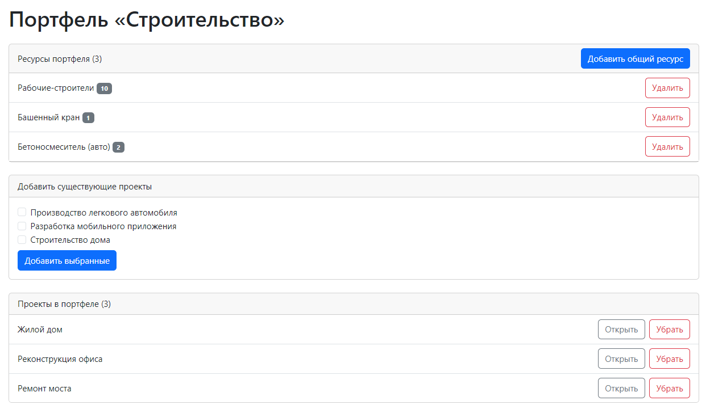
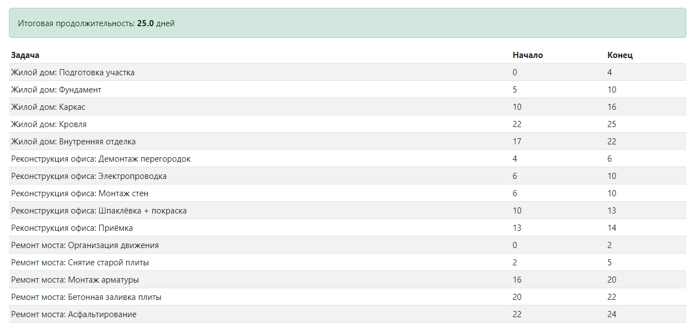
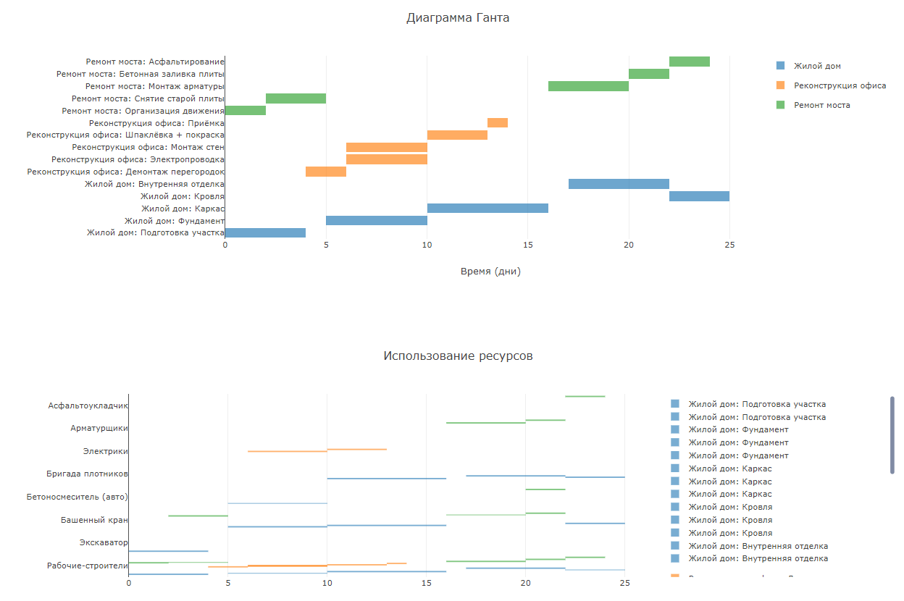
